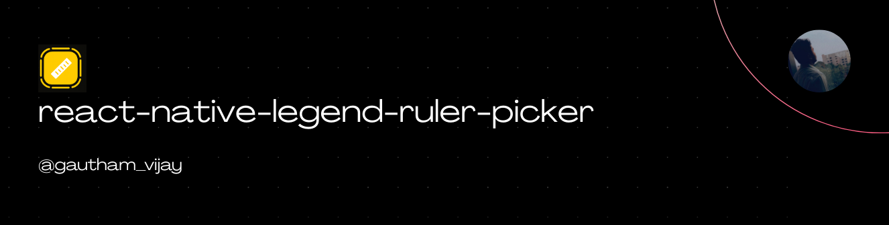
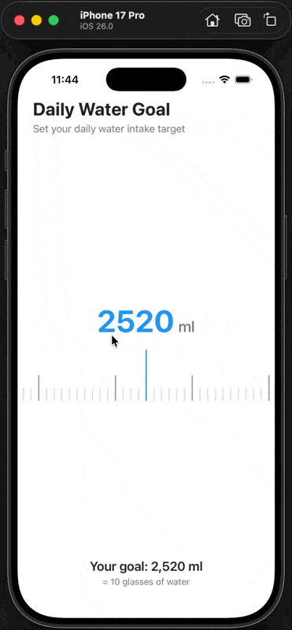
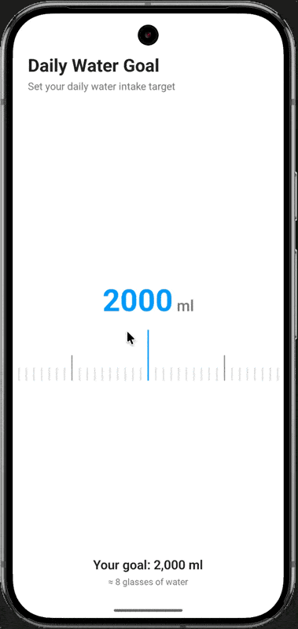

<a href="https://gauthamvijay.com">
  <picture>
    
  </picture>
</a>

# react-native-legend-ruler-picker

⚡ A high-performance, customizable Ruler Picker component for React Native — powered by [LegendList](https://legendapp.com/open-source/list/) for buttery-smooth scrolling.

---

## ✨ Why Legend Ruler Picker?

This library is an upgraded, more performant alternative to [`react-native-ruler-picker`](https://github.com/rnheroes/react-native-ruler-picker) which I have been using it for more than a year without issues.

When I upgraded from old architecture to new architecture for my apps, the performance was not good and I had flickering issues on the labels and inconsistent positioning issues of the indicator.

I decided to create this library, which is actively used in my work app in the appstores.

This library works well for new architecture as it is going to be the defacto and recommended architecture for react native moving forward.

**LegendList** provides superior performance through advanced item recycling, reduced re-renders, and optimized memory usage — making this the ideal choice for production apps.

---

## Demo

<table>
  <tr>
    <th align="center">🍏 iOS Demo</th>
    <th align="center">🤖 Android Demo</th>
  </tr>
  <tr>
    <td align="center">
    
    </td>
    <td align="center">
      
    </td>
  </tr>
</table>

--

## 📦 Installation

```bash
# Using npm
npm install react-native-legend-ruler-picker @legendapp/list

# Using yarn
yarn add react-native-legend-ruler-picker @legendapp/list

# Using pnpm
pnpm add react-native-legend-ruler-picker @legendapp/list
```

> **Note:** `@legendapp/list` is a peer dependency and must be installed separately.

---

## 🚀 Quick Start

```tsx
import { RulerPicker } from 'react-native-legend-ruler-picker';

export default function App() {
  return (
    <RulerPicker
      min={0}
      max={200}
      step={1}
      initialValue={170}
      fractionDigits={0}
      unit="cm"
      onValueChangeEnd={(value) => console.log('Selected:', value)}
    />
  );
}
```

---

## 📖 Complete Example

```tsx
import { useState, useCallback } from 'react';
import { View, StyleSheet, Text, SafeAreaView } from 'react-native';
import { RulerPicker } from 'react-native-legend-ruler-picker';

export default function App() {
  const [height, setHeight] = useState(170);

  const handleValueChangeEnd = useCallback((value: string) => {
    setHeight(Number(value));
  }, []);

  return (
    <SafeAreaView style={styles.container}>
      <View style={styles.header}>
        <Text style={styles.title}>Select Your Height</Text>
      </View>

      <View style={styles.pickerContainer}>
        <RulerPicker
          min={100}
          max={220}
          step={1}
          initialValue={height}
          fractionDigits={0}
          unit="cm"
          onValueChangeEnd={handleValueChangeEnd}
          indicatorColor="#6366F1"
          shortStepColor="#E5E7EB"
          longStepColor="#9CA3AF"
          valueTextStyle={styles.valueText}
          unitTextStyle={styles.unitText}
        />
      </View>

      <View style={styles.footer}>
        <Text style={styles.resultText}>{height} cm</Text>
        <Text style={styles.subtitleText}>
          ≈ {Math.floor(height / 30.48)}'{Math.round((height % 30.48) / 2.54)}"
        </Text>
      </View>
    </SafeAreaView>
  );
}

const styles = StyleSheet.create({
  container: {
    flex: 1,
    backgroundColor: '#FAFAFA',
  },
  header: {
    paddingHorizontal: 24,
    paddingTop: 32,
  },
  title: {
    fontSize: 24,
    fontWeight: '700',
    color: '#111827',
  },
  pickerContainer: {
    flex: 1,
    justifyContent: 'center',
  },
  footer: {
    paddingBottom: 48,
    alignItems: 'center',
  },
  resultText: {
    fontSize: 32,
    fontWeight: '700',
    color: '#6366F1',
  },
  subtitleText: {
    fontSize: 16,
    color: '#6B7280',
    marginTop: 4,
  },
  valueText: {
    fontSize: 48,
    fontWeight: '700',
    color: '#6366F1',
  },
  unitText: {
    fontSize: 24,
    fontWeight: '500',
    color: '#9CA3AF',
  },
});
```

---

## ⚙️ Props

| Prop               | Type                           | Default       | Description                                  |
| ------------------ | ------------------------------ | ------------- | -------------------------------------------- |
| `min`              | `number`                       | **Required**  | Minimum value of the ruler                   |
| `max`              | `number`                       | **Required**  | Maximum value of the ruler                   |
| `step`             | `number`                       | `1`           | Step increment between values                |
| `initialValue`     | `number`                       | `min`         | Initial selected value                       |
| `fractionDigits`   | `number`                       | `1`           | Decimal places to display                    |
| `unit`             | `string`                       | `'cm'`        | Unit label displayed next to value           |
| `width`            | `number`                       | `screenWidth` | Width of the ruler picker                    |
| `height`           | `number`                       | `500`         | Height of the ruler picker                   |
| `indicatorHeight`  | `number`                       | `80`          | Height of the center indicator line          |
| `indicatorColor`   | `string`                       | `'black'`     | Color of the center indicator                |
| `gapBetweenSteps`  | `number`                       | `10`          | Spacing between step markers                 |
| `shortStepHeight`  | `number`                       | `20`          | Height of minor step markers                 |
| `longStepHeight`   | `number`                       | `40`          | Height of major step markers (every 10th)    |
| `stepWidth`        | `number`                       | `2`           | Width of step markers                        |
| `shortStepColor`   | `string`                       | `'lightgray'` | Color of minor step markers                  |
| `longStepColor`    | `string`                       | `'darkgray'`  | Color of major step markers                  |
| `valueTextStyle`   | `TextStyle`                    | -             | Custom styles for the value text             |
| `unitTextStyle`    | `TextStyle`                    | -             | Custom styles for the unit text              |
| `decelerationRate` | `'fast' \| 'normal' \| number` | `'normal'`    | Scroll deceleration rate                     |
| `onValueChange`    | `(value: string) => void`      | -             | Called on every value change while scrolling |
| `onValueChangeEnd` | `(value: string) => void`      | -             | Called when scrolling ends                   |

---

## 🎨 Customization Examples

### Weight Picker (kg)

```tsx
<RulerPicker
  min={30}
  max={200}
  step={0.5}
  initialValue={70}
  fractionDigits={1}
  unit="kg"
  indicatorColor="#10B981"
/>
```

### Temperature Picker (°F)

```tsx
<RulerPicker
  min={32}
  max={120}
  step={1}
  initialValue={72}
  fractionDigits={0}
  unit="°F"
  indicatorColor="#F59E0B"
  longStepColor="#F59E0B"
/>
```

### Water Intake (ml)

```tsx
<RulerPicker
  min={500}
  max={5000}
  step={50}
  initialValue={2000}
  fractionDigits={0}
  unit="ml"
  indicatorColor="#3B82F6"
/>
```

---

## 🧩 Supported Platforms

| Platform    | Status             |
| ----------- | ------------------ |
| **iOS**     | ✅ Fully Supported |
| **Android** | ✅ Fully Supported |

---

## 📋 Requirements

- `@legendapp/list` `2.0.6` or higher

---

## 🤝 Contributing

Contributions are welcome! Please see the [contributing guide](CONTRIBUTING.md) to get started.

---

## 📄 License

MIT © [Gautham Vijayan](https://gauthamvijay.com)

---

## 🙏 Acknowledgments

- Inspired by [`react-native-ruler-picker`](https://github.com/rnheroes/react-native-ruler-picker)
- Powered by [LegendList](https://legendapp.com/open-source/list/) from Legend App
